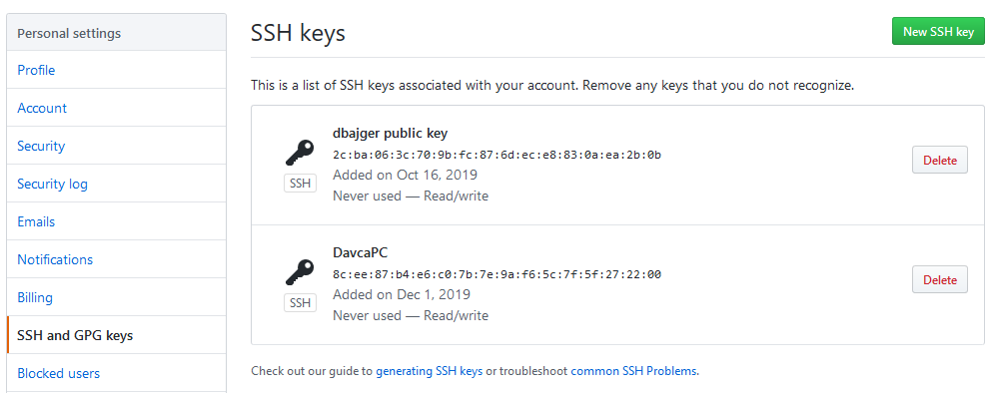

# Pharo-snippets
Pharo Project code snippets and useful hints

# Setting up Github environment
## SSH keys on Github
* Generate new public/private key pair if needed: https://help.github.com/articles/generating-an-ssh-key/
* Open Configuration on Github:


## SSH keys in Pharo
Open configuration of Iceberg tool and set local path:



# Pharo IDE
Using dark UI theme: 
```
Metacello new 
    baseline: 'PharoDawnTheme';
    repository: 'github://sebastianconcept/PharoDawnTheme';
    load.
```
