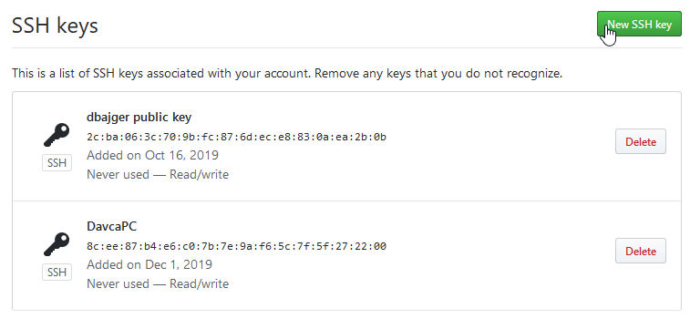
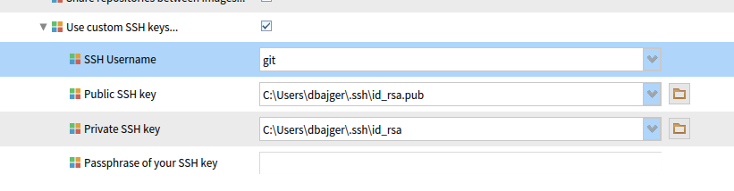

# Pharo-snippets
Pharo Project code snippets and useful hints. Some topics here:  
  * [Concurrent programming hints](./concurrent-programming.md)


# Setting up Github environment
## Step 1: SSH keys on Github
* Generate new public/private key pair if needed: https://help.github.com/articles/generating-an-ssh-key/
* Open Configuration on Github: User -> Settings -> SSH and GPG keys



## Step 2: SSH keys, auth. token and other settings for Iceberg in Pharo
Open configuration of Iceberg tool (World menu > Tools > Iceberg > click Settings icon) and set:
- local path to ssh keys:  

- set Default Code Subdirectory to: 'src'
- set File format type to: 'Tonel'  
- set github token on credential list (that was previously 

- see full description 

## Step 2a: Optionally, setup Github CLI
Github CLI is useful when doing manual changes with repo (from command line).  
There is auth option to use GH CLI, installation here: https://github.com/cli/cli#installation  
- install e.g. using `brew install gh`  
- set authentication method for git command line: `gh auth login` and select: HTTPS and then 'Authenticate using browser'  
Git remote commands then run using GH CLI authentication  
- alternativelly, you can login via token e.g.: `gh auth login --with-token < some-token.txt`

## Step 3: Set local path to image directory
Open system configuration from World menu > Pharo > Settings > System tab > Local Directory > click directory icon and navigate to path, where directory with image is located


## Step 4: Create new (or use existing) Github repository


## Step 5: Clone repository in Iceberg from Github
- Open Iceberg and click '+' add icon
- Choose "Clone from Github.com"
- Set your name from Github and type repository name you want to clone
- Choose "HTTPS" and click Ok  


## Step 6: Repair metadata of empty repository
After cloning, you'll see project in Iceberg in state, where project metadata (how packages, classes are organized in repo) are missing. State "No project found" will be on line with cloned repo.  

- Choose "Repair repository" in context menu (right-click on repo)
- Select "Create project meta-data" and click ok
- Choose Format "Tonel" instead of Filetree and then ok

## Step 7: Add packages, package extensions to your repository
- Select your repo and right-click again, Choose "Packages"  


- Click '+' icon to add your packages (including extenstions) to your repo
- Select desired packages and then ok

## Step 8: Commit and push changes to main branch directly
- Right click on your repo and choose "Commit"  
- Type message to your commit, review changes  
- Select "Push changes to origin/main"  
  
- Type missing git properties (Github name, email)  
  
**That's it! Check your changes on Gihtub.**  

## Step 8a: Optionally, commit changes using feature branch and PR  
- Right click on repo in Pharo and select "Github -> Create new branch for an issue"  

- Select a remote branch (depending if you want to pull title from issue on your own repo on GH or original repo from which you did fork)  
- Put referencing issue nr. (title will be pulled from issue on GH)  
- Then right click and select "commit" and then "Push"  
- Put "Fixes #<issueNr>" on first line and add description on additional lines and click "commit"  
- Right click on repo and choose "Gitbub -> Create Pull request"  

- Check head branch and remote (base) branch and press "Create pull request"  


## Step 9: Define Baseline to load project dependencies (packages) in correct order (recommended)
- Define in repo BaselineOfMyProject class like this (where MyProject is name of your project):
```
BaselineOf subclass: #BaselineOfMyProject
	slots: {  }
	classVariables: {  }
	package: 'BaselineOfMyProject'
```
Tbd.

# Useful git snippets, hints
## Resetting commits from repo
- On local repo just checkout branch where you want to remove/wipe-out commits
- Check stutus of last commits e.g. by: `git log --pretty=format:"%h - %an, %ar : %s"`  
- Execute e.g.: `git reset --hard HEAD~3` (this will remove last 3 commits from local branch)
- then execute:`git push origin -f` which will remove commits also on remote repo
## Rebasing branch  
Rebasing is useful when feature or issue branch is based on deprecated state of repo (forked long time ago). Therefore it is useful to sync with main branch and rebase commits from feature branch, so related PR can be merged and conflicts can be resolved.
- To switch to feature branch: `git checkout feature-branch`
- Rebase commits with main branch: `git rebase main`  
[See more](https://www.freecodecamp.org/news/the-ultimate-guide-to-git-merge-and-git-rebase)  

## Squash commits into one
Squashing is useful to put together multiple commits into just one commit  
Step 1: run rebase command:   
`git rebase -i HEAD~[X]` to squash last X commits  
Step 2: edit file with commands:  
To define what to do wih each commit, you need to edit file and pick first and squash all others:  
```
pick SHA1 commit 1
s SHA2 commit 2
s SHA3 commit 3
...
```
Details [here](https://www.baeldung.com/ops/git-squash-commits)  

## Cherry picking commits
This is used when you want to apply commit from different branch and individually copy them do current branch  
Step 1: Check out to branch where you want to apply your commits  
Step 2: To cherry-pick all the commits from commit A to commit B (where A is older than B), run:  
```
git cherry-pick A^..B
```
If you want to ignore A itself, run: `git cherry-pick A..B`  

Step 3: Some merge conflicts might occur:  
Resolve them (by editing applying incoming or using current changes) and run `git cherry-pick --continue`  

Details [here](https://stackoverflow.com/questions/1670970/how-to-cherry-pick-multiple-commits)

# VirtualBox hints (for Ubuntu image)
## How to extend image size and partition
1. In VirtualBox, go to File -> Virtual Media manager  
2. Choose image file and extend to needed image size  
TODO pic  
3. Start Ubuntu and go to Apps -> Utilities -> disks  
4. Choose Partitions (primary or logical) used by US (ext.4) and choose resize  
5. Disk (or `df -H`) usage should show new available space  

## Setup of shared folder (with host OS)
1. Install guest additions on Ubuntu
2. Add shared folder device in VirtualBox -> Settings -> shared folder
3. run `sudo mount -t vboxsf <sharedDeviceName> ~/<targetFolder>`

## Remove old packages
Run `sudo apt-get autoremove --purge`  

	
# Pharo IDE
Using dark UI theme: 
```
Metacello new 
    baseline: 'PharoDawnTheme';
    repository: 'github://sebastianconcept/PharoDawnTheme';
    load.
```
# Debugging / profiling
Finding all references: `self pointersTo: anObject` 
or use reference finder by: `ReferenceFinder findPathTo: #nil` 
	
# File system, handling of files
```
"use proper line ending on target platform"
lineEnding := OSPlatform current lineEnding.
	
"using memory file reference - useful in tests"
memoryFileReference := FileSystem memory root / 'exercises'.
```

# Pharo Projects 
## Pharo launcher 
To load: 
```
Metacello new
	repository: 'github://pharo-project/pharo-launcher:dev/src';
	baseline: 'PharoLauncher';
	load
```


## Installing Seaside and Bootstrap4
This should work with P8 stable 64 bit  
Load Bootstrap that will load Seaside as dependency: 
```
Metacello new
      baseline:'Bootstrap4';
      repository: 'github://astares/Seaside-Bootstrap4:master/src';
      load
```
### Installing standalone Seaside
TODO

### Installing standalone Bootstrap
TODO

## Installing Magritte
```
	Metacello new
    baseline:'Magritte';
    repository: 'github://magritte-metamodel/magritte:master';
	onConflictUseLoaded;
    load.
```
## Pharo Web Deployment
Deploying tips in AWS: http://forum.world.st/Getting-Pharo-running-on-AWS-td5117353.html  
https://pharoweekly.wordpress.com/2020/05/20/deployment-tips-from-the-pros/  
http://forum.world.st/running-Pharo8-in-Digitalocean-tt5115160.html  

Options to easily setup a custom server: running a virtual machine in Azure, AWS, Google Cloud or elsewhere usually only takes a few minutes.  So it's not different from other web deployments: run on a specific port and put a webserver like Apache, Nginx or other in front.  

Some more Seaside specific resources:
 - https://www.linode.com/docs/guides/deploy-smalltalk-applications-with-seaside/  
 - http://book.seaside.st/book/advanced/deployment/deployment-preparing  
 - https://ci.inria.fr/pharo-contribution/job/EnterprisePharoBook/lastSuccessfulBuild/artifact/book-result/DeploymentWeb/DeployForProduction.html  

You can also use docker to deploy (see http://wiki.astares.com/pharo/612)
  
  
### REST via Seaside
https://github.com/SeasideSt/Seaside/wiki/Seaside-REST  
