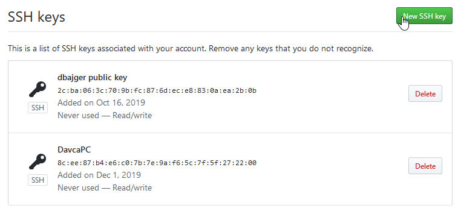
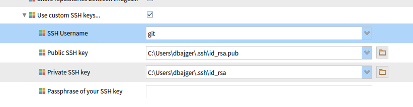

# Pharo-snippets
Pharo Project code snippets and useful hints

# Setting up Github environment
## SSH keys on Github
* Generate new public/private key pair if needed: https://help.github.com/articles/generating-an-ssh-key/
* Open Configuration on Github: User -> Settings -> SSH and GPG keys



## SSH keys in Pharo
Open configuration of Iceberg tool and set local path:



# Pharo IDE
Using dark UI theme: 
```
Metacello new 
    baseline: 'PharoDawnTheme';
    repository: 'github://sebastianconcept/PharoDawnTheme';
    load.
```
# Pharo Web Image 
This should work with P8 stable 64 bit

## Installing Seaside and Bootstrap4
Load Bootstrap that will load Seaside as dependency: 
```
Metacello new
      baseline:'Bootstrap4';
      repository: 'github://astares/Seaside-Bootstrap4:master/src';
      load
```
### Installing standalone Seaside
TODO

### Installing standalone Bootstrap
TODO

## Installing Magritte
```
	Metacello new
    baseline:'Magritte';
    repository: 'github://magritte-metamodel/magritte:master';
	onConflictUseLoaded;
    load.
```
## Pharo Web Deployment
* Deploying tips in AWS: http://forum.world.st/Getting-Pharo-running-on-AWS-td5117353.html
* https://pharoweekly.wordpress.com/2020/05/20/deployment-tips-from-the-pros/
* http://forum.world.st/running-Pharo8-in-Digitalocean-tt5115160.html

